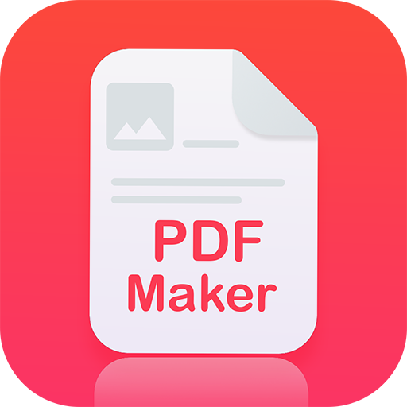

<h1 align="center"> 

</h1>

<p align="center">
  <a href="#-about">About</a>&nbsp;&nbsp;&nbsp;|&nbsp;&nbsp;&nbsp;
  <a href="#-technologies">Technologies</a>&nbsp;&nbsp;&nbsp;|&nbsp;&nbsp;&nbsp;
  <a href="#information_source-how-to-use">How to use</a>&nbsp;&nbsp;&nbsp;|&nbsp;&nbsp;&nbsp;
  <a href="#-license">License</a>
</p>

## 📖 About
A simple project to reading database data and make a PDF file using [NodeJs](https://nodejs.org/en/)

## 🚀 Technologies
- [Express](https://expressjs.com/pt-br/)
- [PDFMake](http://pdfmake.org/index.html#/)
- [Prisma](https://www.prisma.io/)
- [Postgres SQL](https://www.postgresql.org/)
- [MomentJs](https://momentjs.com/)


## :information_source: How to use

To clone and run this application, you'll need [Git](https://git-scm.com) and  [Node.js v14.16](https://nodejs.org) higher installed on your computer. This project utilized too [Yarn v1.22.5](https://yarnpkg.com). From your command line:

```bash
# Clone this repository
$ git clone https://github.com/jvrapi/pdf-maker.git

# Go into the repository
$ cd pdf-maker

# Install dependencies
$ yarn install or npm install

# Start the project
$ yarn dev or npm run dev

```

The database url must be configured into `.env` file. Just rename the `.env.example` file to `.env` and configure your database url.

## 📝 License
This project is under the MIT license. See the [LICENSE](LICENSE) for more information.

---


<div align="center">


Made with ❤ by [João Vitor Santos](https://github.com/jvrapi) 👋 Get in touch!

[](https://www.linkedin.com/in/joaovitorssdelima/) 
[](mailto:joaooviitoorr@gmail.com) 
[](mailto:joaooviitorr@hotmail.com)
	
</div>